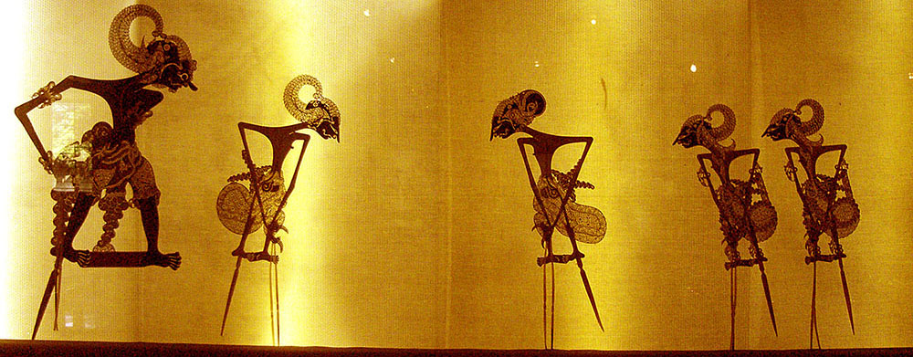
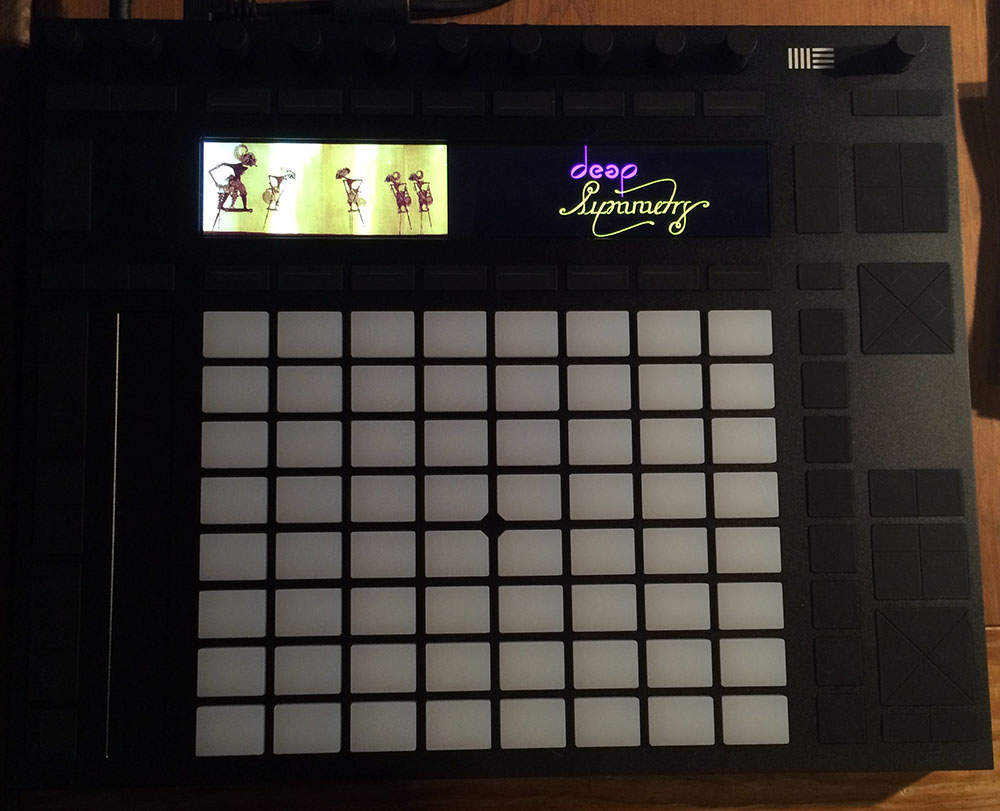
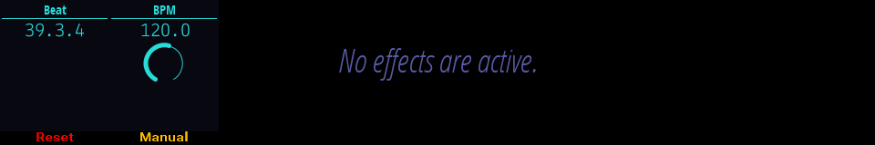

# Wayang

A Java library for displaying images on the
[Ableton Push 2](https://www.ableton.com/en/push/) instrument. The
project name, which refers to
[Javanese shadow puppet artistry](https://en.wikipedia.org/wiki/Wayang),
was chosen because it ties together the concepts Java, Push, and
images.

[](https://commons.wikimedia.org/wiki/File:Wayang_Pandawa.jpg)

[](#license)

## Dependencies

Wayang uses
[usb4java](http://usb4java.org/quickstart/javax-usb.html) to
communicate with the Push. For that to work, you need to have
[libusb](http://libusb.info) installed on your system. If you are on
Linux it is likely already installed, or you can follow their
installation instructions. On the Mac, I recommend using
[Homebrew](http://brew.sh) for all such needs; once it&rsquo;s
installed, you can simply run `brew install libusb`.

> If you are already using the
> [Open Lighting Architecture](https://www.openlighting.org/ola/),
> perhaps through
> [Afterglow](https://github.com/brunchboy/afterglow#afterglow), then
> libusb was installed as part of installing OLA.

## Installing

Wayang is available through Maven Central, so to use it in your Maven
project, all you need is to include the appropriate dependency.

[](https://maven-badges.herokuapp.com/maven-central/org.deepsymmetry/wayang)

Click the **maven central** badge above to view the repository entry
for Wayang. The proper format for including the latest release as a
dependency in a variety of tools, including Leiningen if you are using
Wayang from Clojure, can be found in the **Dependency Information**
section.

If you want to manually install Wayang, you can download the library
from the [releases](https://github.com/brunchboy/wayang/releases) page
and put it on your project&rsquo;s class path. Be sure you get the
right version: the much larger file whose name ends
`-jar-with-dependencies.jar` contains everything you need to
communicate with `libusb` from Java. The smaller Wayang jar is for use
with dependency management systems like Maven. You can download that
one if you&rsquo;d like, but you will then also be responsible for
installing [usb4java](http://usb4java.org/quickstart/javax-usb.html)
and any transitive dependencies it might have.

## Usage

Once you have the Wayang library added as a dependency, all you need
to do to draw to the Push display is:

```java
import org.deepsymmetry.Wayang;

// ...

        BufferedImage displayImage = Wayang.open();
        Graphics2D graphics = displayImage.createGraphics();

// Perform whatever Java2D drawing operations you'd like to using the graphics object,
// then, whenever you want to update what is showing on the Push:

        Wayang.sendFrame();

// If you want to maximize your frame rate, you can also send frames asynchronously:

        Wayang.sendFrameAsync();

// If you are done talking to it, you can close, as below. Otherwise, the library cleans
// up for you when the JVM exits.

        Wayang.close();

```

The image you get from `Wayang.open()` is 960 pixels wide and 160
pixels tall, the same as the physical display. These values are also
available as the constants `Wayang.DISPLAY_WIDTH` and
`Wayang.DISPLAY_HEIGHT`.

This photo shows the results of running `mvn test` in the project directory:



## Capturing Your Interface

You can save animated GIF files to provide highly meaningful documentation for
your user interfaces, thanks to an embedded version of Elliot Kroo&rsquo;s
[GifSequenceWriter](http://elliot.kroo.net/software/java/GifSequenceWriter/).
To do that, just call:

```java
import org.deepsymmetry.GifSequenceWriter;

// ...

    ImageOutputStream output =
      new FileImageOutputStream(new File("out.gif"));

    // Pass in the displayImage buffer that Wayang.open() gave you, the
    // interval in milliseconds at which you update the display, and
    // whether you want the animation to loop:
    GifSequenceWriter writer =
      new GifSequenceWriter(output, displayImage, 50, true);

// Then whenever you are calling Wayang.SendFrame(), also call:

        writer.writeToSequence(displayImage);

// When you are done recording, call:

        writer.close();
        output.close();

```

Here is an example recording from [Afterglow](https://github.com/brunchboy/afterglow#afterglow)&rsquo;s
Push 2 interface:



## Push Interface Documentation

Ableton has released the documentation that enabled the creation of
this library as its own project on Github,
[push-interface](https://github.com/Ableton/push-interface).

## Credits

Wyang photo by [Gunawan Kartapranata](https://commons.wikimedia.org/wiki/User:Gunkarta), used under the [Creative Commons](https://en.wikipedia.org/wiki/en:Creative_Commons) [Attribution-Share Alike 3.0 Unported](https://creativecommons.org/licenses/by-sa/3.0/deed.en) license.

GifSequenceWriter by [Elliot Kroo](http://elliot.kroo.net/software/java/GifSequenceWriter/), used under the [Creative Commons](https://en.wikipedia.org/wiki/en:Creative_Commons) [Attribution 3.0 Unported License](http://creativecommons.org/licenses/by/3.0/).

## License

<a href="http://deepsymmetry.org"></a>


Copyright © 2016–2022 [Deep Symmetry, LLC](http://deepsymmetry.org)

Distributed under the [Eclipse Public License
2.0](https://opensource.org/licenses/EPL-2.0). By using this software
in any fashion, you are agreeing to be bound by the terms of this
license. You must not remove this notice, or any other, from this
software. A copy of the license can be found in
[LICENSE.md](LICENSE.md) within this project.
